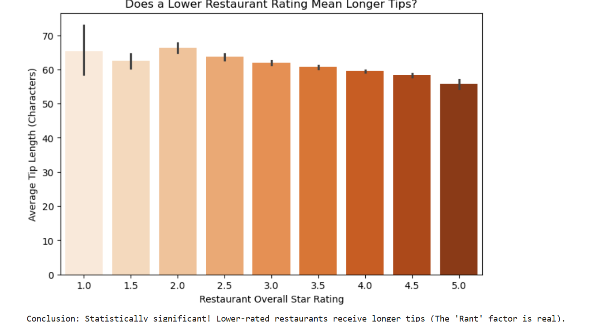
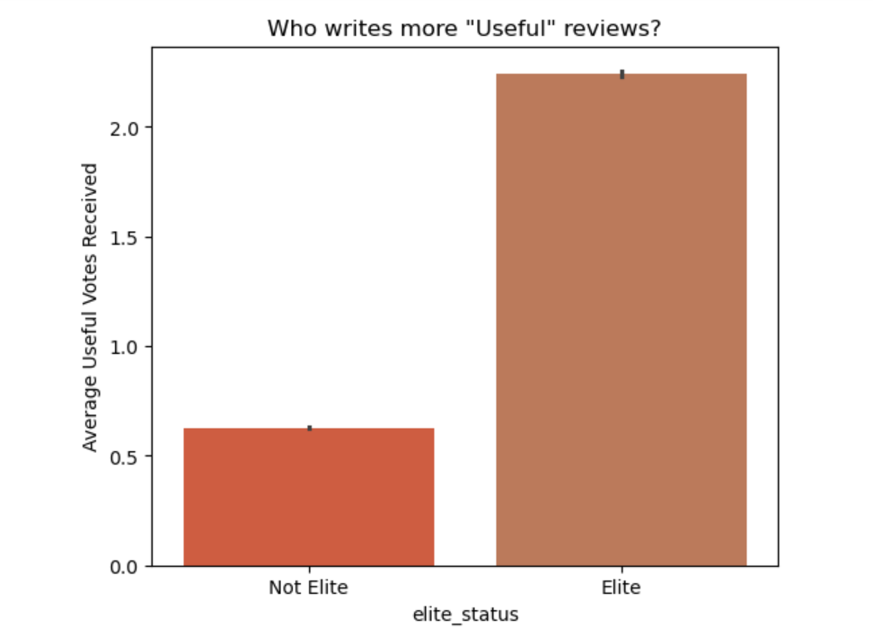

# Yelp-Restaurant-Intelligence-SQL-Streamlit
Built an end-to-end Yelp Restaurant Intelligence System using Python, SQL, and Streamlit. This interactive dashboard analyzes a 2GB+ SQLite database to extract business insights, utilizing inferential statistics (SciPy) to mathematically prove hypotheses about customer sentiment, foot traffic surges, and Elite reviewer influence on reputation.

# 🍽️ Yelp Restaurant Intelligence System
**SQL Database Analytics & Streamlit Interactive Dashboard**

## 📌 Table of Contents
- [Project Overview](#project-overview)
- [Business Objectives](#business-objectives)
- [Data Sources](#data-sources)
- [Exploratory Data Analysis](#exploratory-data-analysis)
- [Statistical Techniques Used](#statistical-techniques-used)
- [Statistical Evaluation](#statistical-evaluation)
- [Application](#application)
- [Project Structure](#project-structure)
- [How to Run This Project](#how-to-run-this-project)
- [Author & Contact](#author--contact)

---

<h2 id="project-overview">🚀 Project Overview</h2>

This project implements an **end-to-end Data Analytics and Business Intelligence system** designed to support restaurant owners and stakeholders by:
1. **Extracting and processing massive datasets** from a 2GB+ SQLite relational database using complex SQL joins and aggregations.
2. **Proving business hypotheses mathematically** using statistical testing (T-Tests and Pearson Correlations).
3. **Deploying an interactive Streamlit web application** that allows non-technical users to dynamically filter restaurants and view live analytics.

<h2 id="business-objectives">🎯 Business Objectives</h2>

**1. Customer Sentiment & Verbosity ("The Rant Factor")** Investigate if a restaurant's overall star rating impacts how much customers write.
- **Why it matters:** Understanding if customers write longer warnings for bad experiences versus short praises for good ones helps managers prioritize which feedback channels to monitor.



**2. Foot Traffic Optimization (Weekend vs. Weekday)** Automatically detect if a specific restaurant experiences a statistically significant surge in physical check-ins on weekends.
- **Why it matters:** Prevents over-staffing on weekends for restaurants with flat traffic, while ensuring high-volume restaurants scale their inventory and front-of-house staff by exact, data-backed margins.


**3. Marketing Strategy & Influencer Impact (The Elite Influence)** Determine if the Yelp community values "Elite" users' reviews significantly more than average users for a given establishment.
- **Why it matters:** If Elite reviews dictate a restaurant's reputation, owners can pivot their marketing budget toward hosting exclusive Elite-tasting events for a higher ROI.


  
<h2 id="data-sources">🗄️ Data Sources</h2>

Data is extracted from the official **Yelp Open Dataset** (housed in an internal SQLite database `yelp.db`) consisting of multiple tables:
- **`business` table:** Restaurant metadata, overall star ratings, and review counts.
- **`review` table:** Individual user ratings, dates, and community voting metrics (Useful, Funny, Cool).
- **`tip` table:** Short-form customer feedback and timestamps.
- **`checkin` table:** Aggregated physical foot-traffic timestamps.
- **`user` table:** Reviewer metadata including "Elite" status timelines.

*(Note: Due to GitHub's file size limits, the 2GB+ SQLite database is not hosted in this repository. A link to the raw data source is provided in the `/data` folder).*

<h2 id="exploratory-data-analysis">🔍 Exploratory Data Analysis</h2>

Key findings during EDA:
- Customer engagement (tips, check-ins, reviews) is strongly correlated; high check-ins naturally drive high review volumes.
- Peak review hours heavily concentrate around specific times of the day, allowing for targeted ad-spend during high-engagement windows.
- The distribution of user activity requires dynamic grouping (using Pandas) to accurately compare daily patterns.

<h2 id="statistical-techniques-used">⚙️ Statistical Techniques Used</h2>

Instead of predictive Machine Learning, this project utilizes **Inferential Statistics (`scipy.stats`)** to prove business realities:
1. **Data Preprocessing:** SQL Common Table Expressions (CTEs) and Pandas `to_datetime()` for temporal cleaning.
2. **Pearson Correlation:** Used to test the linear relationship between a restaurant's star rating and the character length of customer tips.
3. **Independent Two-Sample T-Tests:** Used to compare the average daily foot traffic (Weekends vs. Weekdays) and community trust metrics (Elite vs. Non-Elite useful votes).

<h2 id="statistical-evaluation">📊 Statistical Evaluation</h2>

Every business insight in the dashboard is validated using rigorous mathematical standards:
- **P-Value Threshold (< 0.05):** Hypotheses are only accepted if there is less than a 5% probability that the observed trend is due to random chance. 
- **Dynamic Calculation:** Because local trends (single restaurants) differ from global trends (the whole database), T-statistics and P-values are recalculated live in the dashboard based on user selection.

<h2 id="application">🌐 Application</h2>

The project includes a fully interactive **Streamlit Web Application** for business stakeholders.  
Users can select any restaurant from a dropdown menu to instantly view two modules:
- **📊 Engagement Trends:** Displays core KPIs (Total Reviews, Average Rating) and a live Matplotlib visualization of the busiest hours of the day.
- **🧪 Advanced Research:** Runs live SQL queries and statistical hypothesis tests in the background, outputting plain-English conclusions and charts regarding foot traffic, customer verbosity, and Elite user influence.

<h2 id="project-structure">📁 Project Structure</h2>

```text
├── data/
│   └── data_source_link.md         # Instructions & link to Yelp Open Dataset
├── notebooks/
│   ├── 01_data_extraction_and_cleaning.ipynb  # Database connection & SQL EDA
│   └── 02_eda_and_hypothesis_testing.ipynb    # Pandas manipulation & Scipy stats
├── images/
│   ├── core_metrics_dashboard.png  # Streamlit Tab 1 Screenshot
│   ├── rant_factor.png             # Chart Screenshot
│   ├── weekend_traffic.png         # Chart Screenshot
│   └── elite_influence.png         # Chart Screenshot
├── report/
│   └── Yelp_Intelligence_Report.pdf # Final business presentation/report
├── app.py                          # Streamlit User Interface application
└── README.md

```

